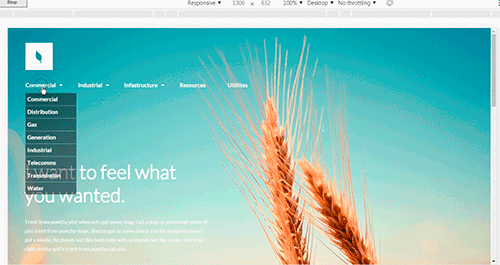

# Organic

## Описание 

Адаптивная верстка под мобильные экраны, планшеты и десктопы. Макет построен на сетке flexbox Grid. Применена библиотека jquery.

        В связи с тем что данная страница является шаблонам. Некоторые ссылки могут не работать.
## Стек технологий примененный при разработке шаблона

*   [ECMAScript 5](http://es5.github.io/)
*   [jQuery](https://jquery-docs.ru/)
*   [Flexboxgrid](https://github.com/kristoferjoseph/flexboxgrid)
*   [slider slick](https://kenwheeler.github.io/slick/)

##  Тесты    

Протестировано на следующих браузерах. Указаны версии где шаблон работает без ограничений.

### Desktop 
|   IE  |   Edge    |   Firefox |   Chrome  |  Safari   |   Opera   |   
|-------|-----------|-----------|-----------|-----------|-----------|  
|  11   |           |    45.0   |    46.0   |           |           |
|       |           |    65.0   |    72.0   |           |    58.0   |

### Mobile 
| IOS Safari | Opera Mobile | Android Browser | Chrome for Android | Firefox for android |
|------------|--------------|-----------------|--------------------|---------------------|
|            |     53.3     |                 |         72.0       |          65.0       |

##  Валидация    
Валидацию проходит.    

## Tест скорости    
[https://developers.google.com/speed/](https://developers.google.com/speed/)

|  ***Для компьютеров***                    |***93%*** |        
|-------------------------------------------|----------|       
| Время загрузки первого контента           | 0,5 сек. |
| Индекс скорости загрузки                  | 1,6 сек. |
| Время загрузки для взаимодействия         | 1,1 сек. |
| Время загрузки достаточной части контента | 1,1 сек. |
| Время окончания работы ЦП                 | 1,1 сек. |
| Приблизительное время задержки при вводе  | 10 мс    |

|       ***Для мобильных***                 |***80%*** | 
|-------------------------------------------|----------|       
| Время загрузки первого контента           | 1,8 сек. |
| Индекс скорости загрузки                  | 4,2 сек. |
| Время загрузки для взаимодействия         | 4,7 сек. |
| Время загрузки достаточной части контента | 4,7 сек. |
| Время окончания работы ЦП                 | 4,7 сек. |
| Приблизительное время задержки при вводе  | 10 мс    |

##     Скриншоты шаблона

